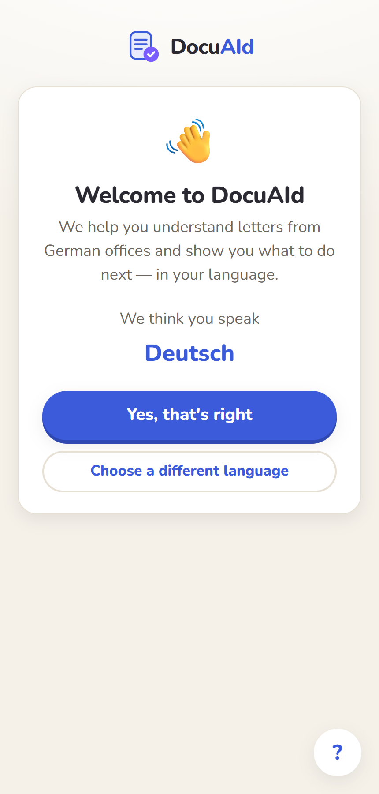
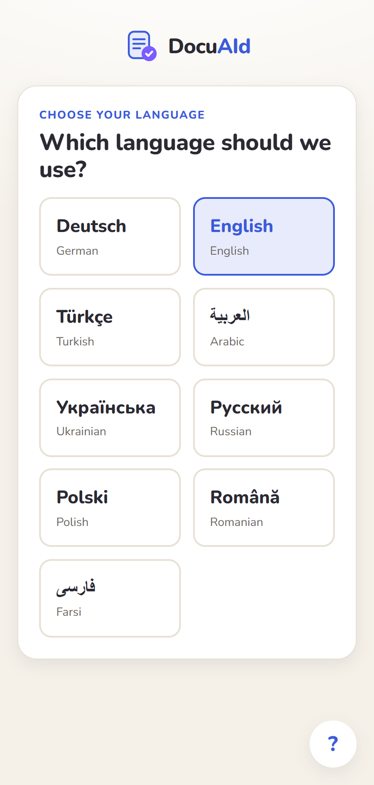
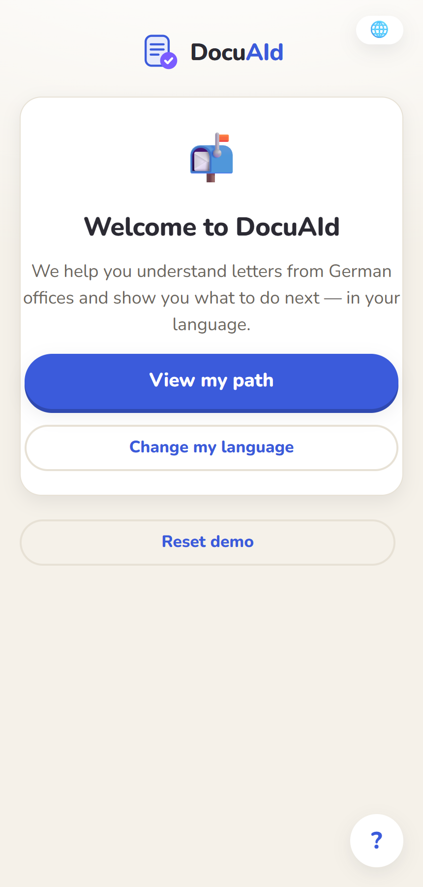
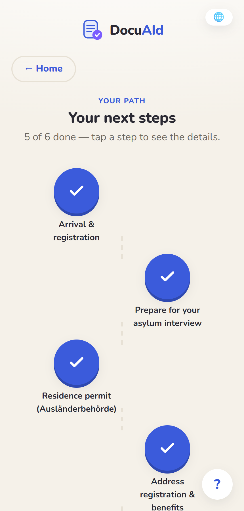
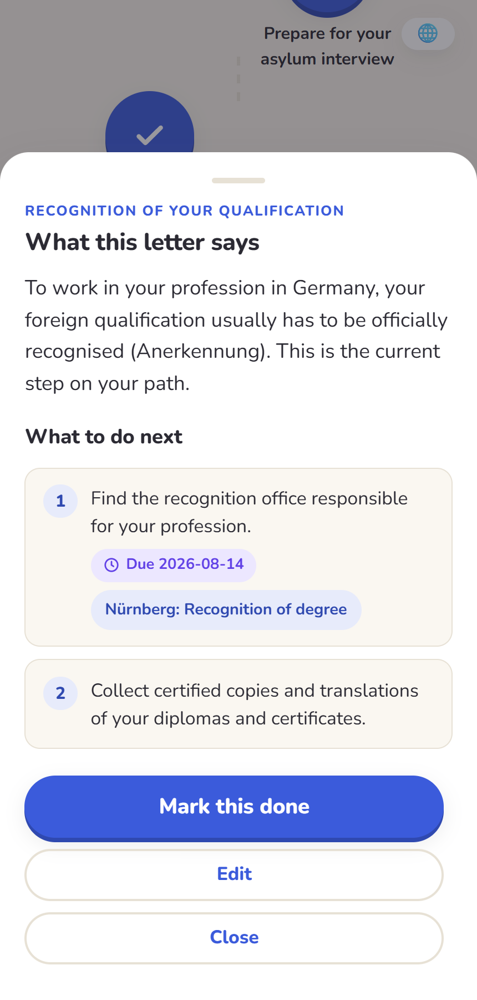
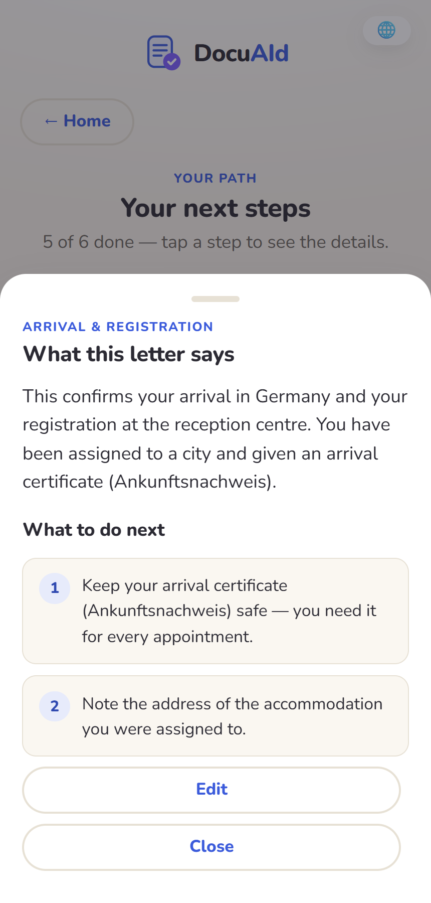
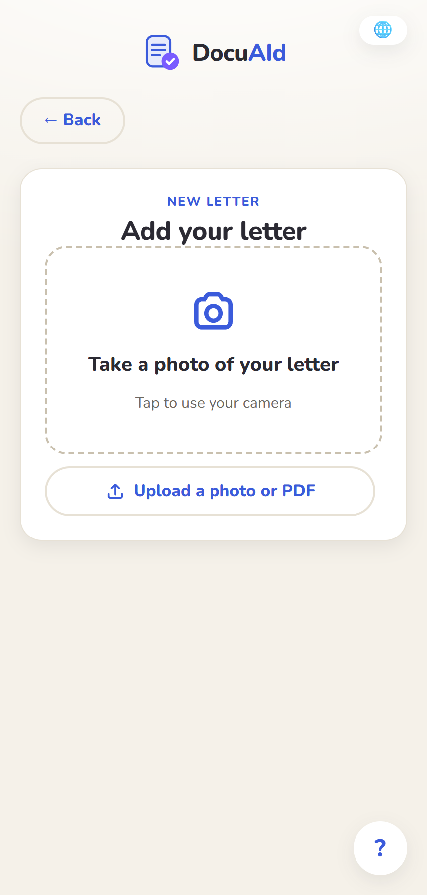
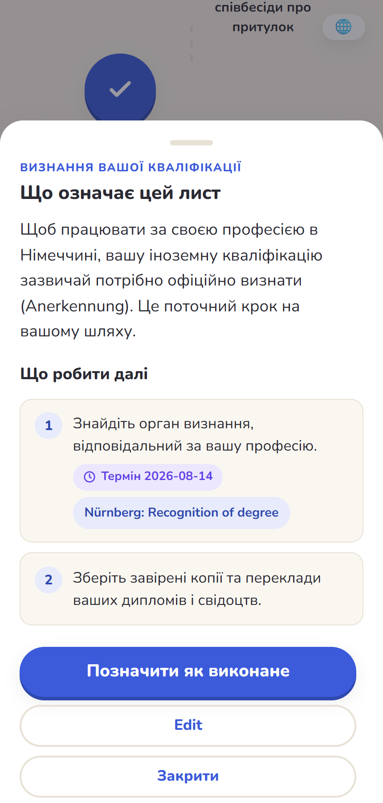

# DocuAId

**Your personal guide to understanding German bureaucracy and its documents.**

People arriving in Germany struggle to understand what the authorities demand from
them before they can work and live here. DocuAId lets them **photograph a letter from
the Ausländerbehörde** (or any other office), and get back a **translation into their
own language** plus **clear, actionable next steps** — laid out as a visual journey
through the recognition process.

Built for the **ZOLLHOF track of the Claude Impact Lab Hackathon** (Nuremberg, 23 July
2026). Powered by the Claude API for multimodal document understanding.

---

## Walkthrough

| Onboarding — language detection | Language picker | Home |
|---|---|---|
|  |  |  |

The user picks the language they understand best **once**, at onboarding. It is
auto-detected from the browser and sent with every request that needs translation.

| Your path | Active step (detail) | Completed step (detail) |
|---|---|---|
|  |  |  |

The **path** is a linear journey of migration steps. Each node holds the translated
document text and a numbered list of next steps — with optional **due dates** and
**links to the responsible offices/forms**. The current step is `active`; completed
steps are `done`. Tap any node to open its detail sheet; the active step can be marked
done or edited.

| Add a letter (upload) | Same journey in Ukrainian |
|---|---|
|  |  |

Uploading a letter (photo or PDF, multi-page) sends the pages to Claude, which returns
the translation and extracted next steps **in the user's language**. The result is
appended as a new `active` node. Everything the user reads — path, steps, deadlines — is
rendered in their chosen language (Ukrainian shown above).

> Screenshots are regenerated with `scratchpad/shots.mjs` against a locally running
> stack. Document analysis is not shown here because it requires a live `ANTHROPIC_API_KEY`.

---

## How it works

```
  Frontend (SvelteKit)                 Backend (Express 5, Node >=24)
  ────────────────────                 ──────────────────────────────
  Svelte 5 runes                       GET   /api/path              ┌───────────┐
  Tailwind                   HTTP/JSON  POST  /api/analyze-document ─┤ Claude API │
  client-rendered      ───────────────► POST  /api/path/nodes       │ sonnet-5,  │
  single-user demo                     PATCH /api/path/nodes/:id     │ tool-use   │
  in-memory locale                                                  └───────────┘
                                       persists to node:sqlite (docuaid.db)
```

- **Frontend** (`src/frontend`) — SvelteKit, rendered fully on the client (`ssr = false`).
  State lives in Svelte-5 runes (`src/lib/state`). The API client is a thin `fetch`
  wrapper (`src/lib/api/client.ts`). UI copy is translated per-language in
  `src/lib/i18n.ts` for the curated shortlist in `src/lib/languages.ts`.
- **Backend** (`src/backend`) — Express 5 on Node ≥ 24. Persists the path in a local
  SQLite file via the built-in `node:sqlite` module (no ORM, no external DB). The
  `/api/analyze-document` route calls Claude with a **forced tool-use** schema
  (`record_analysis`) so the model returns structured `{ translation, nextSteps }`
  rather than free text (`src/backend/src/claude.ts`).
- **Demo seed** — opening the path with a `?lang=` seeds an example migration journey
  (arrival → asylum interview → residence permit → registration → work permit →
  **qualification recognition**) in EN / UK / TR, derived from the LIFE Initiative
  bureaucracy guides. See `src/backend/src/seed.ts`.

The full **frontend ↔ backend API contract** (the `PathNode` shape and every endpoint)
is documented in [`CLAUDE.md`](CLAUDE.md#frontend--backend-api-contract-docuaid).

---

## Running locally

**Prerequisites:** Node **≥ 24** (the backend uses the built-in `node:sqlite`, and runs
`.ts` files directly via Node's type-stripping — no build step), and an
[Anthropic API key](https://console.anthropic.com/) for document analysis.

### 1. Backend

```sh
cd src/backend
cp .env.example .env        # then set ANTHROPIC_API_KEY=sk-ant-...
npm install
npm run dev                 # http://localhost:3001  (or: npm start)
```

Without a valid `ANTHROPIC_API_KEY` the app works fully **except** document analysis:
the seeded path, node details, edit, and mark-done all run against SQLite alone.

### 2. Frontend

```sh
cd src/frontend
cp .env.example .env        # set PUBLIC_API_BASE_URL=http://localhost:3001
npm install
npm run dev                 # http://localhost:5173
```

Open http://localhost:5173 and pick a language to start.

### Tests

```sh
cd src/backend  && npm test         # node:test suite (routes, db, claude, seed, ...)
cd src/frontend && npm test         # vitest
cd src/backend  && npm run smoke    # end-to-end smoke against a running backend
```

---

## Project structure

```
src/
├─ frontend/          SvelteKit app (onboarding, path, upload)
│  └─ src/
│     ├─ routes/      /, /onboarding, /path, /upload
│     └─ lib/         components, api client, i18n, languages, rune state
├─ backend/           Express + node:sqlite API
│  └─ src/
│     ├─ routes/      path.ts, analyze.ts
│     ├─ claude.ts    Claude tool-use document analysis
│     ├─ db.ts        SQLite persistence
│     ├─ seed.ts      the seeded EN/UK/TR demo journey
│     └─ enrichment/  occupations.ts (data-pack groundwork — see below)
docs/                 design specs & the implementation plan (gitignored)
zollhof-recognition-data-pack/   open data for the recognition problem (gitignored)
```

## The data pack

`zollhof-recognition-data-pack/` bundles the open data for the recognition problem
(ESCO ↔ ISCO-08 ↔ KldB 2010 crosswalk → Destatis / Bundesagentur für Arbeit labour-market
data). It is **gitignored** and must be present locally to use the occupation-enrichment
groundwork. Read its `README.md` before consuming it — several sources are *call-live,
do-not-redistribute*, and ESCO has no Ukrainian or Turkish labels. Full integration notes
are in [`CLAUDE.md`](CLAUDE.md).

---

## Status & where to continue

**Working today (the hackathon-required pipeline):** onboarding + language selection →
seeded visual path → **upload → Claude analysis → translation + next steps** → append as
a new node → edit / mark-done. Persistence, CORS, and the JSON error contract are in place.

Good next steps, roughly in priority order:

1. **Wire up occupation enrichment.** `src/backend/src/enrichment/occupations.ts` connects
   a detected profession to *regulated / shortage-occupation* facts from the data pack, but
   is **not wired into any route** and its substring matching is unvalidated (short queries
   match arbitrarily; ESCO has no UK/TR labels). Validate matching, then surface it in the
   analysis so the app can suggest the **responsible recognition office** — the original
   user story. Build the cache with `scripts/build-data-cache.py`.
2. **Suggest the right office for the user's city** (BAMF-NAvI / anabin / Anerkennung in
   Deutschland). Note these are *call-live, do-not-redistribute* — see the data-pack README.
3. **Generate the email/letter drafts** from the user stories (a German + native-language
   copy-paste proposal when a step says "write to…"). Not built yet.
4. **PII handling.** The concept calls for detecting and handling PII in uploaded documents;
   there is currently no PII step.
5. **Multi-user + real persistence.** Today it is a single-user local demo (one SQLite file,
   in-memory locale that resets on full reload). Add auth + per-user storage for real use.
6. **Finish i18n coverage.** A few detail-sheet controls (e.g. the *Edit* button) still fall
   back to English — see `src/lib/i18n.ts`.
7. **Non-linear paths.** The `locked` node status exists in the contract but is unused; it is
   reserved for a future branching journey.
